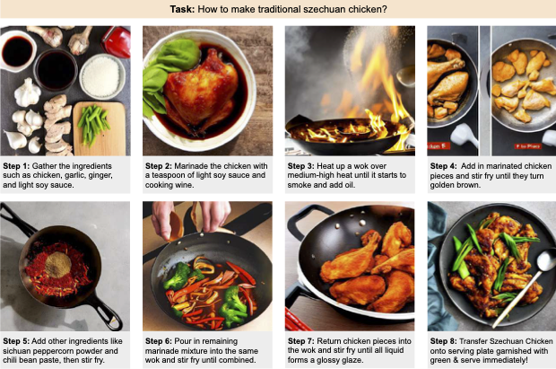
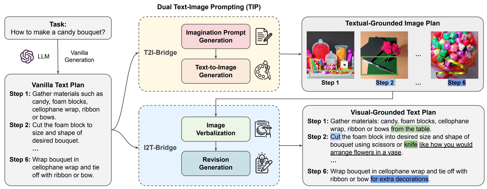

# TIP
<p align="center">
   🤗 <a href="https://yujielu10.github.io/" target="_blank">Demo [Coming Soon]</a> 📃 <a href="https://arxiv.org/abs/2305.01795" target="_blank">Paper</a> 🐦 <a href="https://twitter.com/yujielu_10" target="_blank">Twitter</a><br>
</p>
Thrilled to release TIP (Dual Text-Image Prompting), a Text-to-Image model enhanced Large Language Model that can generate coherent and authentic multimodal procedural plans toward a high-level goal.
Please check out our paper <a href="https://drive.google.com/file/d/10k4YCCgTjQr1cb6O3Gigzqjwqu10JTst/view?usp=sharing" target="_blank">"Multimodal Procedural Planning via Dual Text-Image Prompting"</a>!

## Overview
Our dual Text-Image Prompting (TIP) model generates coherent and authentic multimodal procedural
plans with multiple steps towards a high-level goal, providing useful guidelines in task completion.
<p align="center">
</img>
</p>
The vanilla text plan is generated using LLM. Our Text-Image Prompting (TIP) generates the textual-
grounded image plan using T2I-Bridge (Fig. 3) and the visual-grounded text plan using I2T-Bridge (Fig. 5). The
colors blue and green highlight the improved grounding in text and image respectively.
<p align="center">
</img>
</p>

Improved grounding in textual and visual context are highlighted in pink and green respectively. Red texts
indicate reasoning of physical action in image plan generation.
<p align="center">
</img>
</p>

## Installation

```
git clone --recursive git@github.com:YujieLu10/MPP.git
cd MPP
conda create -n mpp
conda activate mpp
conda install pytorch torchvision torchaudio pytorch-cuda=11.7 -c pytorch -c nvidia
pip install transformers==4.19.2 diffusers invisible-watermark
pip install -e .
pip install -r requirements.txt
sh install.sh
```


## Zero-shot Planning
### Data Preprocess - Caption Generation
Generate captions for WikiPLAN and RecipePLAN
```
python preprocessors/generate_caption.py --source groundtruth_input
python preprocessors/generate_caption.py --source experiment_output
```

### Multimodal Procedural Planning
Baselines
- m-plan: multimodal procedural planning, llm and t2i model will collaboratively generating procedural planning
- u-plan: unimodal procedural planning that seperately plan in textual and visual space (in mpp, it means first use llm to generate textual plan, and then use t2i model to visualize as visual plan)
- t(v)gt-u-plan: visual procedural planning with ground truth textual procedural plans, aka. generating visual plans directly using ground truth textual plan (textual procedural planning with ground truth visual procedural plans, aka. generating textual plans directly using ground truth visual plan)

Run below command to use our TIP to generate multimodal procedural plans:
```
python planning.py --task m-plan
```

Try out other baseliens by replace default **m-plan** with **tgt-u-plan-dalle**, **vgt-u-plan-blip**.
```
python planning.py --task tgt-u-plan-dalle
python planning.py --task vgt-u-plan-blip
```

For T2I and I2T bridge ablation:
```
python planning.py --task m-plan --t2i_template_check

python planning.py --task m-plan --i2t_template_check
```

Caption Base:
- BLIP w/ ViT-B and CapFilt-L (model_base_caption_capfilt_large.pth)
- OFA-Base (https://huggingface.co/OFA-Sys/ofa-base)

T2I Base:
- DALLE (OPENAI 512x512)
- Stablediffusion V2 (v2-1_512-ema-pruned.ckpt)

## Evaluation
To generate plans for evaluation:
```
python planning.py --eval --data_type wikihow --eval_task all
```

To visualize the plan grid:
```
python amt_platform/generate_plan_grid.py --source experiment_output
```

To generate Amazon Mechnical Turk evaluation format:
```
python amt_platform/get_amt_h2h_csv.py --source experiment_output
```

Check template robustness:
```
python evaluators/template_robustness.py
```
